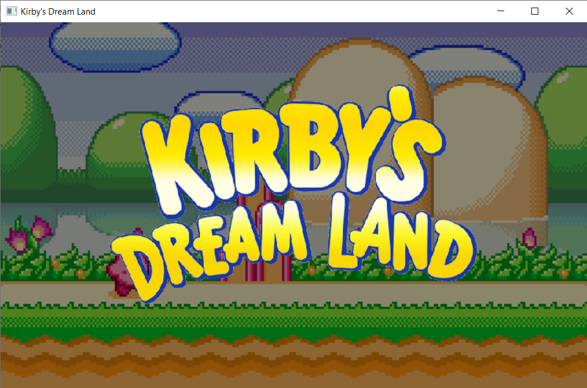

# The Kirby Land
## Authors
- Dolendo, Jericho Paolo T.
- Bartolome, Vallerie C.
## Description
The Kirby Land is a basic alien-shooter game based on Java. The goal is to survive the alien invasion for 60 seconds with the help of certain powerups. Kirby can shoot bullets to kill enemies, he can also collect powerups to gain health or improve bullets. Defeat the boss that will spawn deep into the space.
## Usage
1. Clone the repository.
2. Using Eclipse, import the clone as a project.
3. Configure Eclipse to run Java SE 8 (jre1.8 and jdk8.0.261).
4. Run Main class.
5. Enjoy the game!
## Examples

